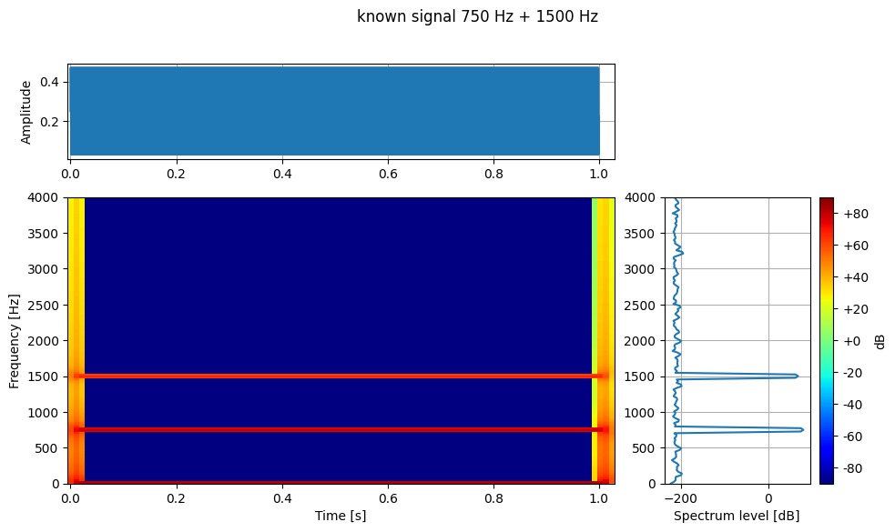
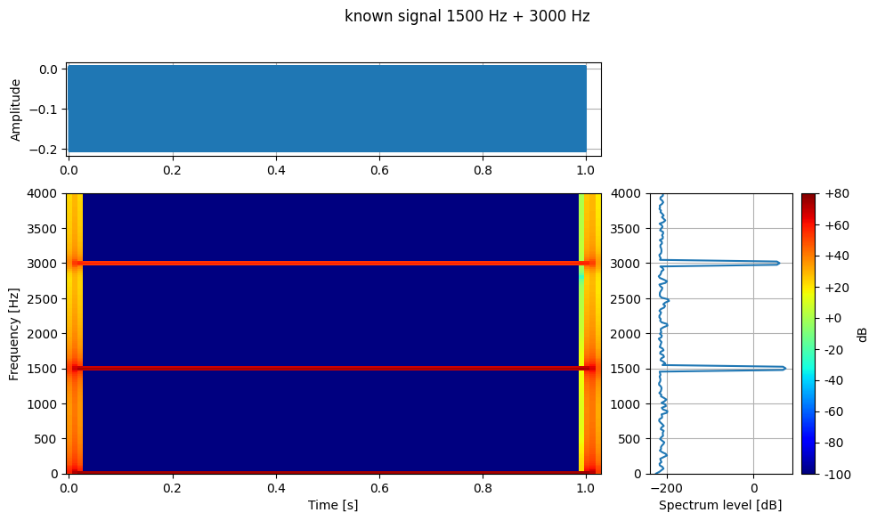
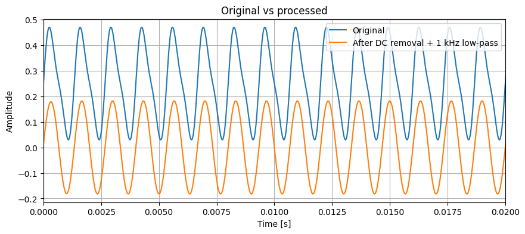
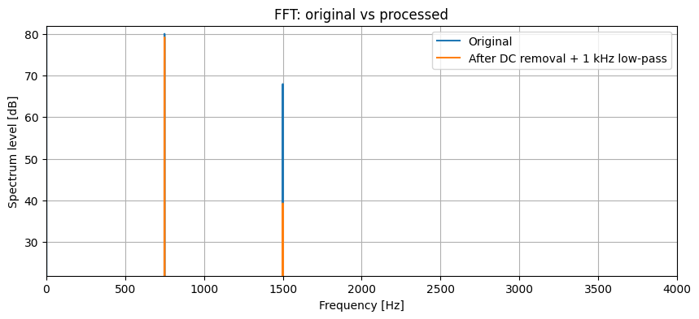

# Wandas

[English](README.md) | 日本語


[](https://pypi.org/project/wandas/)
[](https://pypi.org/project/wandas/)
[](https://github.com/kasahart/wandas/actions/workflows/ci.yml)
[](https://codecov.io/gh/kasahart/wandas)
[](https://github.com/kasahart/wandas/blob/main/LICENSE)
[](https://pypi.org/project/wandas/)

**信号解析を、データフレームを扱うように。**

Wandas は、波形・時系列データを `ChannelFrame` として扱う Python ライブラリです。サンプル列だけでなく、サンプリング周波数、チャンネル名、単位、メタデータ、処理履歴を一緒に持ったまま、確認、前処理、変換、可視化まで進められます。

`array`、`sampling_rate`、`channels`、処理メモを別々に持ち回る代わりに、1 つの frame に文脈を持たせたまま、意図した信号と結果が合っているか確認できます。

この frame-first の考え方は、チームや AI エージェントと解析を共有・レビューする場面で特に効きます。コード、ラベル、単位、メタデータ、処理履歴、生成した図が近い場所に残るので、実装内容の確認とレビューが進めやすくなります。

## 既知信号で確認する

まず答えが分かっている信号から始めます。片方のチャンネルには DC オフセット付きの 750 Hz と 1500 Hz、もう片方には別の DC オフセット付きの 1500 Hz と 3000 Hz を入れます。最初に `describe()` で frame 全体を見てから、個別の図で前処理後の波形とスペクトルを確認します。

```python
import numpy as np
import wandas as wd

sr = 48_000
t = np.arange(sr) / sr
labels = ["750 Hz + 1500 Hz", "1500 Hz + 3000 Hz"]


def tone(components, *, offset=0.0):
    return offset + sum(amplitude * np.sin(2 * np.pi * freq * t) for freq, amplitude in components)


samples = np.vstack([
    tone([(750, 0.20), (1500, 0.05)], offset=0.25),
    tone([(1500, 0.10), (3000, 0.02)], offset=-0.10),
]).astype(np.float64)

signal = wd.from_numpy(
    samples,
    sampling_rate=sr,
    label="known signal",
    ch_labels=labels,
    ch_units="Pa",
)

signal.describe(fmax=4_000, image_save="readme_known_signal_describe.png")

clean = signal.remove_dc()
spectrum = clean.welch(n_fft=4096)

clean.plot(overlay=True, xlim=(0, 0.02), title="Known signal after remove_dc()", label=labels)
spectrum.plot(overlay=True, xlim=(0, 4_000), title="Welch spectrum of the known signal", label=labels)
```

最初の図は元の frame から Wandas の `describe()` が出力したものです。各チャンネルの波形、スペクトログラム、スペクトルを 1 つの表示で確認できます。





次の波形表示では、`remove_dc()` の後に DC オフセットが消えていることが分かります。



最後のスペクトル表示では、1 つ目のチャンネルの 750 Hz / 1500 Hz、2 つ目のチャンネルの 1500 Hz / 3000 Hz が見えます。



## Wandas を試したくなるところ

- **フレーム指向の信号解析**: サンプリング周波数、長さ、チャンネル、ラベル、単位、メタデータを知っているオブジェクトとして扱えます。
- **レビューしやすい解析フロー**: コード、データ文脈、処理履歴、図がつながるので、チームや AI エージェントが同じ解析を確認しやすくなります。
- **生データから洞察までが短い**: 読み込み、トリミング、フィルタ、正規化、リサンプリング、要約、変換、プロットを一貫したメソッドでつなげられます。
- **時間・周波数・時間周波数を行き来できる**: `ChannelFrame` から `SpectralFrame`、`SpectrogramFrame`、`NOctFrame` へ、文脈を失わずに移れます。
- **実用的な音響解析も同じ流れで**: RMS トレンド、騒音レベル、A 特性、オクターブバンド、ラウドネス、粗さを必要に応じて扱えます。
- **実データで使いやすい**: WAV/FLAC/OGG/AIFF/SND/CSV、URL、bytes、file-like、NumPy 配列、録音フォルダ、`io` extra を使った Wandas WDF ファイルを扱えます。
- **探索に向いている**: `describe()`、Matplotlib と親和性の高いプロット、marimo 学習アプリで、まず見る・試すがすぐできます。

## インストール

最初に試すなら、インタラクティブ表示と学習アプリを含む extra 付きがおすすめです。

```bash
pip install "wandas[marimo]"
```

最小構成で入れる場合:

```bash
pip install wandas
```

core-only インストールでも、波形フレーム、CSV/WAV 読み込み、処理、プロット、`is_close=False` や `image_save` を使った `describe()` の図作成・保存ワークフローは利用できます。デフォルトのインタラクティブな `frame.describe()` 表示には `marimo` extra を使います。

必要な機能に応じて optional extras を組み合わせられます。

```bash
pip install "wandas[io]"              # WDF の保存・読み込み
pip install "wandas[effects]"         # librosa ベースのオーディオエフェクト
pip install "wandas[marimo]"          # marimo 学習アプリとインタラクティブ表示
pip install "wandas[psychoacoustic]"  # ラウドネス、粗さ、オクターブバンド補助機能
pip install "wandas[ml]"              # Torch/TensorFlow テンソル補助機能

pip install "wandas[marimo,io,effects,psychoacoustic]"
```

## 手元のデータで使う

既知信号で表示の読み方が分かったら、生成した配列を録音ファイルに置き換えます。同じ frame-first の流れで確認できます。

```python
import wandas as wd

recording = wd.read("recording.wav", start=0, end=10)
recording.describe(fmin=20, fmax=8_000, image_save="recording_overview.png")
```

SPL、ラウドネス、粗さ、オクターブバンドを扱う場合は、校正済みの音圧データを使います。これらの例には `wandas[psychoacoustic]` extra が必要です。WDF の保存・読み込みは `wandas[io]` に含まれます。

## 小さな top-level API

- `wd.read("audio.wav")`: WAV、CSV、対応音声、URL、bytes、file-like input。
- `wd.from_numpy(data, sampling_rate=48_000)`: 配列から frame を作成。
- `wd.from_folder("recordings/", recursive=True)`: フォルダ由来の dataset を作成。
- `wd.load("analysis.wdf")`: `wandas[io]` で Wandas ネイティブ WDF を読み込み。
- `wd.supported_formats()`: 登録済み reader 形式を確認。

既存コード向けに `read_wav()`、`read_csv()`、`from_ndarray()` は残っていますが、新しい例では `read()` と `from_numpy()` を使います。

## 主なオブジェクト

- `ChannelFrame`: チャンネルを持つ時間領域の波形・センサーデータ。
- `SpectralFrame`: FFT、Welch、コヒーレンス、CSD、伝達関数の結果。
- `SpectrogramFrame`: STFT などの時間周波数データ。
- `NOctFrame`: オクターブ、分数オクターブスペクトル。
- `ChannelFrameDataset`: フォルダ内の録音をまとめて扱うバッチ処理向けコレクション。

## 向いている用途

Wandas は、特に次のような場面で便利です。

- Notebook や marimo アプリで信号処理パイプラインを試作したい。
- フィルタや変換を試す間も、チャンネルメタデータを失いたくない。
- 音響録音をすばやく確認してから、詳細解析に進みたい。
- 複数の WAV/CSV ファイルを同じ API で比較したい。
- 信号処理の学習・説明用に読みやすいサンプルを作りたい。

## 次に読む

- [公式ドキュメント](https://kasahart.github.io/wandas/) - ガイド、API リファレンス、使用例。
- [学習パス](https://github.com/kasahart/wandas/tree/main/learning-path/) - marimo アプリベースのステップ別チュートリアル。
- [チュートリアル](https://kasahart.github.io/wandas/tutorial/) - 基本ワークフローを順に確認できます。
- [Issue Tracker](https://github.com/kasahart/wandas/issues) - バグ報告や機能提案。

## プロジェクトの状態

Wandas は現在も活発に改善中です。Python 3.10+ を対象にし、MIT License の下で公開されています。本番ワークフローで使う場合は、バージョンを固定し、アップグレード時にリリースノートを確認してください。

## 貢献

貢献を歓迎します。

開発環境セットアップ、品質チェック、ドキュメント規約、プルリクエスト手順は [docs/src/contributing.md](https://kasahart.github.io/wandas/contributing/) を参照してください。

## ライセンス

このプロジェクトは [MIT License](https://github.com/kasahart/wandas/blob/main/LICENSE) の下で公開されています。
