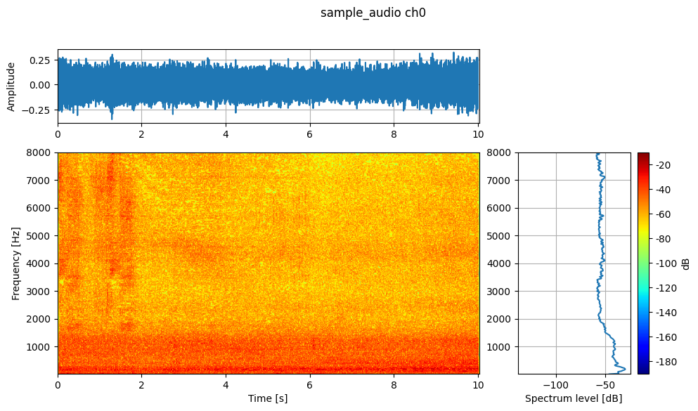
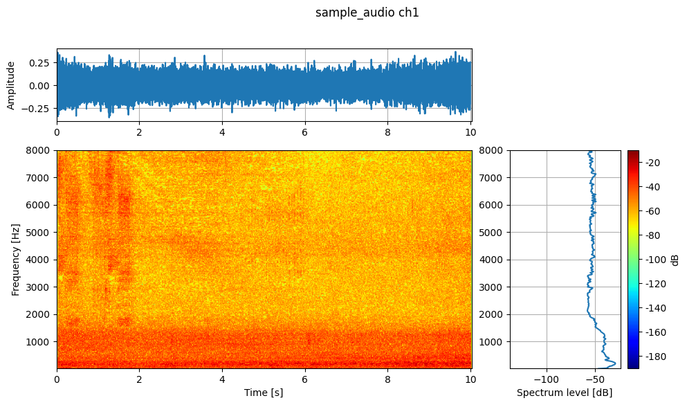

# Wandas

[English](README.md) | 日本語


[](https://pypi.org/project/wandas/)
[](https://pypi.org/project/wandas/)
[](https://github.com/kasahart/wandas/actions/workflows/ci.yml)
[](https://codecov.io/gh/kasahart/wandas)
[](https://github.com/kasahart/wandas/blob/main/LICENSE)
[](https://pypi.org/project/wandas/)

**信号解析を、データフレームを扱うように。**

Wandas は、音声・振動・センサーなどの波形データを `ChannelFrame` として扱う Python ライブラリです。サンプル列だけでなく、サンプリング周波数、チャンネル名、単位、メタデータ、処理履歴を一緒に持ったまま、読み込み、前処理、周波数解析、可視化まで進められます。

信号解析では、波形を NumPy 配列に、サンプリング周波数を別の変数に、ラベルや単位を辞書に、処理手順を Notebook のコメントに持ちがちです。Wandas では、それらを 1 つの frame にまとめ、`wd.read(...) → remove_dc() → low_pass_filter() → fft() → plot()` のように、解析の意図をそのままコードにできます。

各メソッドは元のデータを破壊せず、新しい frame を返します。結果には `operation_history` が残り、`previous` から直前の frame をたどれるため、処理前後の比較や再確認も簡単です。このレビューしやすい解析フローは、チームで解析をレビューするときや AI エージェントに確認を頼むときにも役立ちます。コード、データの文脈、処理履歴、図がつながるので、実装内容の確認とレビューを進めやすくなります。

## なぜ Wandas か

1. **処理の流れが直感的**

   従来は NumPy、SciPy、Matplotlib などをつなぎ、ステップごとに配列の形状や軸を確認する必要がありました。Wandas では、読み込み、フィルタ、FFT、可視化を frame のメソッドとして、分析する順番どおりに書けます。

2. **データ管理と処理履歴を frame に任せられる**

   サンプリング周波数、チャンネル名、単位、メタデータを波形と一緒に保持します。`operation_history` と `previous` により、「どのデータに何をした結果か」を後から追跡できます。

3. **可視化までが早い**

   信号処理は、数値だけでなく波形、スペクトル、スペクトログラムを見ながら進めます。`describe()` なら主要な表示をまとめて確認でき、各 frame の `plot()` で結果をすぐ図にできます。

4. **実データに入りやすい**

   WAV、FLAC、OGG、AIFF、SND、CSV、URL、bytes、file-like object、NumPy 配列を共通の流れに載せられます。録音データもセンサーデータも、読み込んだ後は同じ frame API で扱えます。

5. **大きなデータや ML 前処理へ伸ばせる**

   frame 内の処理は Dask による遅延評価を基本とし、フォルダ内の複数ファイルは `ChannelFrameDataset` で遅延読み込みできます。リサンプリング、トリミング、正規化、STFT をつなぎ、必要に応じて PyTorch / TensorFlow の tensor に変換できます。

## インストール

最初に試すなら、可視化や試聴をしながら結果を確認できる表示機能と、marimo 学習アプリを含む extra 付きがおすすめです。

```bash
pip install "wandas[marimo]"
```

すでに Jupyter / IPython 環境がある場合や、図をファイルとして保存する用途では core-only でも始められます。

```bash
pip install wandas
```

core-only インストールでも、波形フレーム、CSV/WAV 読み込み、信号処理、Matplotlib プロット、`is_close=False` や `image_save` を使った `describe()` の図作成・保存を利用できます。

必要な機能に応じて optional extras を組み合わせられます。

```bash
pip install "wandas[io]"              # WDF の保存・読み込み
pip install "wandas[effects]"         # librosa ベースのオーディオエフェクト
pip install "wandas[marimo]"          # marimo 学習アプリとインタラクティブ表示
pip install "wandas[psychoacoustic]"  # ラウドネス、粗さ、シャープネスなど
pip install "wandas[ml]"              # PyTorch / TensorFlow tensor 変換

pip install "wandas[marimo,io,effects,psychoacoustic]"
```

## サンプル音声を確認する

まずは `describe()` で録音の全体像を見ます。リポジトリをチェックアウトしている場合は同梱ファイルを、PyPI からインストールした環境では同じサンプルの公開 URL を使うので、このコードをそのまま実行できます。

```python
from pathlib import Path

import wandas as wd

local_sample = Path("learning-path/sample_audio.wav")
sample_source = (
    local_sample
    if local_sample.exists()
    else "https://raw.githubusercontent.com/kasahart/wandas/main/learning-path/sample_audio.wav"
)

recording = wd.read(sample_source, end=15, normalize=True)
recording.describe(fmin=20, fmax=8_000, vmin=-80, vmax=-20, image_save="readme_sample_audio_describe.png")
```

`describe()` は、次に何を前処理・計測するかを決める前に、波形、スペクトログラム、Welch スペクトルをまとめて表示します。複数チャンネルの frame では、チャンネルごとに図が保存されます。





ここから先も流れはメソッド中心です。DC オフセットを外すなら `recording.remove_dc()`、ローパスフィルタをかけるなら `.low_pass_filter(cutoff=1_000)`、スペクトルへ変換するなら `.fft()`、図にするなら結果へ `.plot()` を呼びます。配列、サンプリング周波数、チャンネル情報を補助変数として持ち回る必要はありません。

> `normalize=True` は試聴や形状確認のための振幅正規化です。校正値が必要な SPL や心理音響指標には、Pa に換算されたデータを使用してください。

## 既知信号で確認する

次は、答えが分かっている信号で、コードと解析結果が一致することを確かめます。`wd.from_numpy()` を使えば、NumPy 配列にサンプリング周波数、チャンネル名、単位を与えて `ChannelFrame` を作れます。

この例では、750 Hz / 1500 Hz と DC オフセットを含むモノラル信号を作ります。DC 除去と 1 kHz ローパスフィルターを 1 つのメソッドチェインで適用し、`add_channel()` で元信号と加工後をまとめて波形と FFT を重ね書きします。

```python
import numpy as np
import wandas as wd

sr = 48_000
t = np.arange(sr) / sr


def tone(components, *, offset=0.0):
    return offset + sum(amplitude * np.sin(2 * np.pi * freq * t) for freq, amplitude in components)


samples = tone([(750, 0.20), (1500, 0.05)], offset=0.25).astype(np.float64)

signal = wd.from_numpy(
    samples,
    sampling_rate=sr,
    label="known signal",
    ch_labels=["Original"],
    ch_units="Pa",
)

processed = (
    signal
    .remove_dc()
    .low_pass_filter(cutoff=1_000)
    .rename_channels({0: "After DC removal + 1 kHz low-pass"})
)
comparison = signal.add_channel(processed)

comparison.plot(
    overlay=True,
    xlim=(0, 0.02),
    title="Original vs processed",
)
spectrum_ax = comparison.fft().plot(
    overlay=True,
    xlim=(0, 4_000),
    title="FFT: original vs processed",
)
spectrum_ax.set_ylim(30, 90)
```

メソッドチェインは元の `signal` を書き換えず、新しい `ChannelFrame` を返します。`processed.previous` から直前の frame をたどれ、`processed.operation_history` には `remove_dc()` と `low_pass_filter()` が残ります。

`signal.add_channel(processed)` は元信号と加工後を 2 チャンネルの比較 frame にまとめます。波形の重ね書きでは、DC オフセットが消え、フィルター後の波形が変化していることを確認できます。


FFT の縦軸は 30–90 dB の固定範囲で表示します。加工後も 750 Hz 成分が残り、1 kHz のカットオフより高い 1500 Hz 成分が減衰していることを確認できます。


## 手元のデータで使う

サンプルで流れを確認したら、入力を自分の WAV や CSV に置き換えます。同じ frame-first の API で、読み込みから前処理、可視化、周波数解析まで進められます。

```python
import wandas as wd

recording = wd.read("recording.wav", end=15)
clean = recording.remove_dc().normalize()
spectrum = clean.welch()
fmax = min(8_000, clean.sampling_rate / 2)

clean.describe(fmin=20, fmax=fmax, vmin=-80, vmax=-20, image_save="recording_overview.png")
spectrum.plot(xlim=(20, fmax))
```

物理量を扱う解析では、データの校正を保ってください。`normalize()` は振幅を変えるため、SPL、sound level、ラウドネス、粗さ、シャープネスなどを計算するときは、正しく Pa に換算された元データから解析します。心理音響指標には `wandas[psychoacoustic]`、WDF の保存・読み込みには `wandas[io]` が必要です。

複数ファイルでは、`wd.from_folder("recordings/", recursive=True)` から始められます。dataset に対して `.resample(16_000).trim(0, 5).normalize().stft(n_fft=512)` のように前処理をまとめて適用できます。ML へ渡すときは `frame.to_tensor(framework="torch")` または `frame.to_tensor(framework="tensorflow")` を使います（`wandas[ml]` が必要で、変換時に遅延データが実体化されます）。

## 小さな top-level API

- `wd.read("audio.wav")`: WAV、CSV、対応音声、URL、bytes、file-like input を `ChannelFrame` として読み込み。
- `wd.from_numpy(data, sampling_rate=48_000)`: NumPy 配列から frame を作成。
- `wd.from_folder("recordings/", recursive=True)`: フォルダ由来の遅延読み込み dataset を作成。
- `wd.load("analysis.wdf")`: `wandas[io]` で Wandas ネイティブ WDF を読み込み。
- `wd.supported_formats()`: 登録済み reader 形式を確認。

WDF は `wd.read()` ではなく `wd.load()` で読み込みます。既存コード向けに `read_wav()`、`read_csv()`、`from_ndarray()` も残っていますが、新しい例では `read()` と `from_numpy()` を使います。

## 主なオブジェクト

- `ChannelFrame`: チャンネルを持つ時間領域の波形・センサーデータ。
- `SpectralFrame`: FFT、Welch、コヒーレンス、CSD、伝達関数の結果。
- `SpectrogramFrame`: STFT などの時間周波数データ。
- `NOctFrame`: オクターブ、分数オクターブスペクトル。
- `ChannelFrameDataset`: フォルダ内の録音を遅延読み込みし、まとめて前処理するコレクション。

## 向いている用途

Wandas は、特に次のような場面で便利です。

- Notebook や marimo で、波形を見ながら信号処理パイプラインを試作したい。
- 音声・振動・センサーデータのラベル、単位、処理履歴を失いたくない。
- 複数の WAV / CSV ファイルを、同じ前処理と解析 API で比較したい。
- 信号処理の手順と結果を、チームや AI エージェントとレビューしたい。
- STFT などの特徴量を作り、PyTorch / TensorFlow の前処理へつなげたい。

## 次に読む

- [公式ドキュメント](https://kasahart.github.io/wandas/) - ガイド、API リファレンス、使用例。
- [学習パス](https://github.com/kasahart/wandas/tree/main/learning-path/) - marimo アプリベースのステップ別チュートリアル。
- [チュートリアル](https://kasahart.github.io/wandas/tutorial/) - 基本ワークフローを順に確認できます。
- [Issue Tracker](https://github.com/kasahart/wandas/issues) - バグ報告や機能提案。

## プロジェクトの状態

Wandas は現在も活発に改善中です。Python 3.10+ を対象にし、MIT License の下で公開されています。本番ワークフローで使う場合は、バージョンを固定し、アップグレード時にリリースノートを確認してください。

## 貢献

貢献を歓迎します。

開発環境セットアップ、品質チェック、ドキュメント規約、プルリクエスト手順は [docs/src/contributing.md](https://kasahart.github.io/wandas/contributing/) を参照してください。

## ライセンス

このプロジェクトは [MIT License](https://github.com/kasahart/wandas/blob/main/LICENSE) の下で公開されています。
