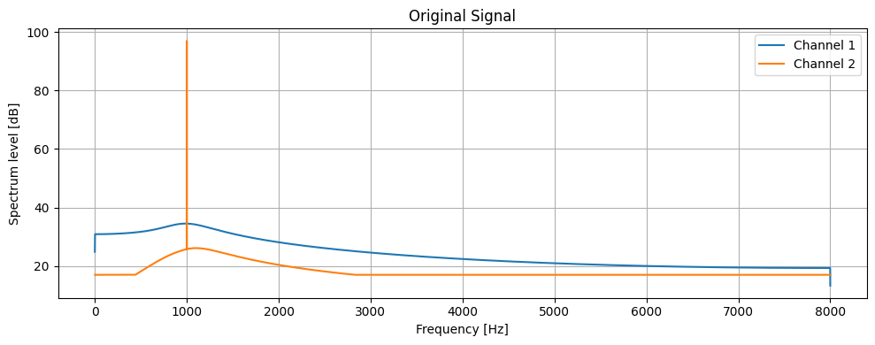

# Wandas: **W**aveform **An**alysis **Da**ta **S**tructures

**Wandas** is an open-source library for efficient signal analysis in Python. Wandas provides comprehensive functionality for signal processing and seamless integration with Matplotlib.

**Wandas** は、Pythonによる効率的な信号解析のためのオープンソースライブラリです。Wandas は、信号処理のための包括的な機能を提供し、Matplotlibとのシームレスな統合を実現しています。

## Features / 機能

- **Comprehensive Signal Processing Functions**: Easily perform basic signal processing operations including filtering, Fourier transforms, and STFT.
  **包括的な信号処理機能**: フィルタリング、フーリエ変換、STFTなど、基本的な信号処理操作を簡単に実行可能。

- **Integration with Visualization Libraries**: Seamlessly integrate with Matplotlib for easy data visualization.
  **可視化ライブラリとの統合**: Matplotlibとシームレスに統合してデータを簡単に可視化可能。

- **Bounded-recording scalability**: Discover and select recordings before loading
  samples, then build lazy Dask graphs across a collection of bounded recordings.
  Graph construction does not compute samples, but kernel execution can materialize a
  complete continuous channel or a whole multichannel Frame, and NumPy/tensor
  conversion materializes the final result. Wandas does not promise arbitrary
  distribution of one enormous Frame. See the
  [scalability contract](explanation/scalability-contract.md).
  **サイズを制御した収録ファイルへの拡張**: sampleを読む前に収録ファイルを探索・選択し、
  サイズを制御した多数の収録ファイルに対して遅延 Dask graph を構築します。graph 構築は
  sample を計算しませんが、kernel 実行時には連続した 1 チャンネル全体または
  マルチチャンネル Frame 全体が実体化されることがあり、NumPy／tensor 変換では最終結果が
  実体化されます。単一の巨大な Frame を自由に分散できるという保証ではありません。
  詳細は[スケーラビリティ契約](explanation/scalability-contract.md)を参照してください。

- **Various Analysis Tools**: Frequency analysis, octave band analysis, time-frequency analysis, and more.
  **多様な分析ツール**: 周波数分析、オクターブバンド分析、時間-周波数分析など。

- **Typed Cepstral Analysis**: Extract, lifter, and reconstruct spectral envelopes while preserving lazy execution and metadata.
  **型付きケプストラム解析**: 遅延実行とメタデータを維持しながら、ケプストラム抽出、リフタリング、スペクトル包絡再構成を実行。

## Usage Examples / 使用例

### Generating and Visualizing a Signal / 信号の生成と可視化

```python
import wandas as wd

signal = wd.generate_sin(freqs=[5000, 1000], duration=1)
signal.low_pass_filter(cutoff=1000).fft().plot()
```



### Filtering / フィルタ処理

```python
import wandas as wd

# Generate a test signal
# テスト信号を生成
signal = wd.generate_sin(freqs=[5000, 1000], duration=1)

# Apply low pass filter and plot FFT
# ローパスフィルタを適用し、FFTをプロット
signal.low_pass_filter(cutoff=1000).fft().plot()
```


For detailed documentation and usage examples, see the [Tutorial](tutorial/index.md).

詳細なドキュメントや使用例については、[チュートリアル](tutorial/index.md)をご覧ください。

## Documentation Structure / ドキュメント構成

- [Tutorial / チュートリアル](tutorial/index.md)
  - 5-minute getting started guide and recipe collection for common tasks.
  - 5分で始められる入門ガイドと一般的なタスクのレシピ集。

- [API Reference / APIリファレンス](api/index.md)
  - Detailed API specifications.
  - 詳細なAPI仕様。

- [Theory & Architecture / 理論背景・アーキテクチャ](explanation/index.md)
  - Design philosophy and algorithm explanations.
  - 設計思想とアルゴリズムの解説。

- [Contributing Guide / 貢献ガイド](contributing.md)
  - Rules and methods for contribution.
  - コントリビューションのルールと方法。

## License / ライセンス

This project is released under the [MIT License](https://opensource.org/licenses/MIT).

このプロジェクトは [MITライセンス](https://opensource.org/licenses/MIT) の下で公開されています。
