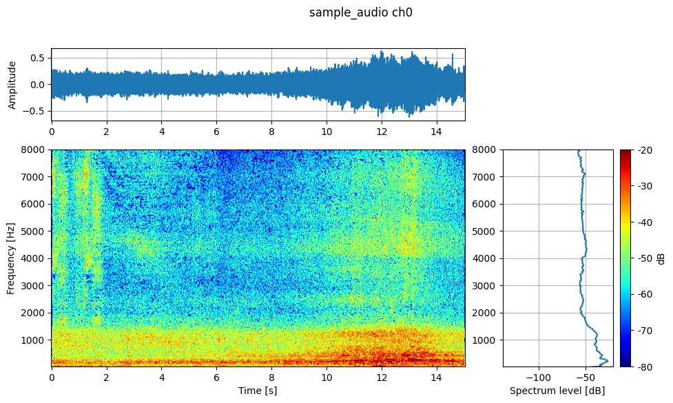
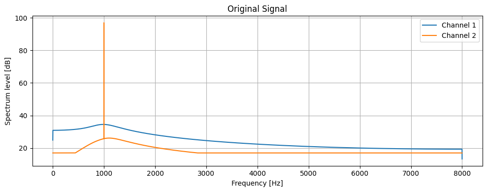

# Tutorial / チュートリアル

This tutorial will teach you the basics of the Wandas library in 5 minutes.
このチュートリアルでは、Wandasライブラリの基本的な使い方を5分で学べます。

## Installation / インストール

Recommended for the learning apps, WDF examples, and psychoacoustic cells:
学習アプリ、WDF 例、音響解析セルを使う場合の推奨インストール:

```bash
pip install "wandas[marimo,io,psychoacoustic]"
```

Core-only install:
core-only インストール:

```bash
pip install wandas
```

## Basic Usage / 基本的な使い方

### 1. Import the Library / ライブラリのインポート

```python exec="on" session="wd_demo"
import wandas as wd
```

### 2. Load Audio Files / 音声ファイルの読み込み

```python
# Read a signal file / 信号ファイルを読み込む
url = "https://github.com/kasahart/wandas/raw/v0.1.6/examples/data/summer_streets1.wav"

audio = wd.read(url)
print(f"Sampling rate / サンプリングレート: {audio.sampling_rate} Hz")
print(f"Number of channels / チャンネル数: {audio.n_channels}")
print(f"Duration / 長さ: {audio.duration} s")
```

```python exec="on" session="wd_demo"
# Read a signal file / 信号ファイルを読み込む
url = "https://github.com/kasahart/wandas/raw/v0.1.6/examples/data/summer_streets1.wav"

audio = wd.read(url)
print(f"Sampling rate / サンプリングレート: {audio.sampling_rate} Hz  ")
print(f"Number of channels / チャンネル数: {audio.n_channels}  ")
print(f"Duration / 長さ: {audio.duration} s  ")
```

### 3. Visualize Signals / 信号の可視化

```python
# Display waveform / 波形を表示
audio.describe()
```



<audio controls src="https://github.com/kasahart/wandas/raw/v0.1.6/examples/data/summer_streets1.wav"></audio>

### 4. Basic Signal Processing / 基本的な信号処理

```python
# Apply a low-pass filter (passing frequencies below 1kHz)
# ローパスフィルタを適用（1kHz以下の周波数を通過）
filtered = audio.low_pass_filter(cutoff=1000)

# Visualize and compare results
# 結果を可視化して比較
filtered.previous.plot(title="Original")
filtered.plot(title="filtered")
```



### Channel selection with `query` / チャンネル選択（`query` 引数）

`get_channel` can select channels using a `query` argument based on metadata instead of indices or labels. Supported queries:
`get_channel` はインデックスやラベルの代わりにメタデータを用いた `query` 引数でチャネルを選択できます。サポートされるクエリ:

- `str`: Exact match for labels / ラベルの完全一致
- `re.Pattern`: Regular expression search on labels / ラベルに対する正規表現検索
- `callable(ChannelMetadata) -> bool`: Metadata predicate / メタデータ述語
- `dict`: Match against attributes of `ChannelMetadata` (can use regex for values) / `ChannelMetadata` の属性に対する一致（値に正規表現を使うことも可能）

Example / 例:

```python
import re

# Get channel with label containing "acc" / ラベルに "acc" を含むチャネルを取得
cf.get_channel(0, query=re.compile(r"acc"))

# Get channel with unit 'g' using metadata predicate / メタデータ述語で取得（単位が g のチャネル）
cf.get_channel(0, query=lambda ch: ch.unit == 'g')

# Dict specification: match on model field and channel.extra key / dict 指定: model フィールド と channel.extra のキーでマッチ
cf.get_channel(0, query={"unit": "g", "gain": 0.8})
```

Note: Keys specified in dict are only allowed for dataclass fields of `ChannelMetadata` or existing keys in the channel's `extra`. Passing unknown keys will raise a `KeyError`.
注意: dict で指定するキーは `ChannelMetadata` のデータクラスフィールドまたは既に存在するチャネルの `extra` キーのみ許容されます。不明なキーを渡すと `KeyError` が発生します。

## Next Steps / 次のステップ

- <a href="../learning-path/06_pipeline_recipe_ux.html">Frame-First Recipe UX (marimo)</a>
  - Start with normal frame method chains, extract a recipe, and replay it on another frame.
  - 通常のframe method chainから始め、Recipeを抽出し、別frameで再現する。
- [Pipeline Recipes Examples / Recipe例](pipeline-recipes.md)
  - Use after the frame-first path when you need graph recipes, custom functions, terminal steps, and extraction boundaries.
  - frame-first導線の後に、graph recipe、custom function、terminal step、抽出境界を確認する。
- [Pipeline Recipe Requirements Check Notebook](pipeline-recipe-requirements-check.md)
  - Run assert-driven checks for the current Pipeline Recipe requirements.
  - Pipeline Recipe 要件を assert 中心の Notebook で確認する。
- [API Reference / APIリファレンス](../api/index.md)
  - Detailed API specifications.
  - 詳細な機能やAPI仕様を調べる。
- [Theory Background / 理論背景](../explanation/index.md)
  - Design philosophy and algorithm explanations.
  - ライブラリの設計思想やアルゴリズムを理解する。

## Learning Path / 学習パス

This section provides links to tutorial marimo apps that demonstrate more detailed features and application examples of the Wandas library.
このセクションでは、Wandasライブラリのより詳細な機能や応用例を、以下のチュートリアル marimo アプリを通じて学ぶことができます。

- <a href="../learning-path/00_why_wandas.html">Learning Path — 00_Why Wandas (marimo)</a>: Overview and motivation / 概要と動機付け
- <a href="../learning-path/01_getting_started.html">Learning Path — 01_Getting Started (marimo)</a>: Setup and basic configuration / セットアップと基本的な設定
- <a href="../learning-path/02_working_with_data.html">Learning Path — 02_Working With Data (marimo)</a>: Reading, inspecting, and simple transformations / 読み込み、検査、基本的な変換
- <a href="../learning-path/03_signal_processing_basics.html">Learning Path — 03_Signal Processing Basics (marimo)</a>: Filtering and frequency analysis / フィルタリングと周波数分析
- <a href="../learning-path/04_advanced_processing.html">Learning Path — 04_Advanced Processing (marimo)</a>: Spectrograms and time-frequency analysis / スペクトログラムと時間周波数解析
- <a href="../learning-path/05_custom_functions.html">Learning Path — 05_Custom Functions (marimo)</a>: Custom frame operations / custom frame操作
- <a href="../learning-path/06_pipeline_recipe_ux.html">Learning Path — 06_Frame-First Recipe UX (marimo)</a>: Extract and replay recipes from normal frame method chains / 通常のframe method chainからRecipeを抽出して再現
